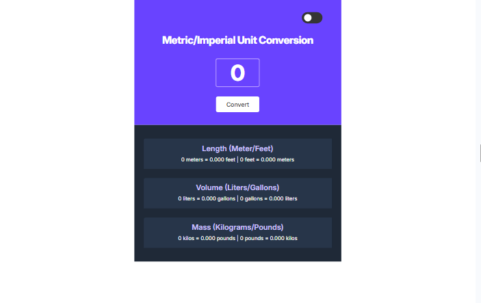

# Unit Converter

## Description

This project is a Unit Converter web app that allows users to quickly convert between length (meters/feet), volume (liters/gallons), and mass (kilograms/pounds). The app features a clean UI, dynamic input resizing, keyboard support, and a theme toggle for improved user experience.

This task was completed as part of the [Scrimba The Fullstack Developer Path](https://scrimba.com/c0fullstack)

---

### Screenshot

---

### Links

- Solution URL: [GitHub](https://github.com/artemkotko14/unit-converter)
- Live Site URL: [Webpage](https://artemkotko14.github.io/unit-converter/)

---

## Features

- Convert between:
  - meters ↔ feet
  - liters ↔ gallons
  - kilograms ↔ pounds
- Input validation (prevents negative numbers)
- Limits input to 12 characters
- Auto-resizing input field based on value length
- Press Enter to trigger conversion
- Prevents accidental value changes via mouse scroll
- Light/Dark theme toggle
- Clean and responsive layout

---

## Technologies Used

- HTML5
- CSS3
- Flexbox
- JavaScript
- CSS Variables

## Future Improvements

- Add live conversion (without button click)
- Improve accessibility (ARIA labels, focus styles)
- Add error messages in UI instead of alerts
- Support decimal precision control
- Add animations for smoother UX

## Author

- Github - [Artem Kotko](https://github.com/artemkotko14)

---
